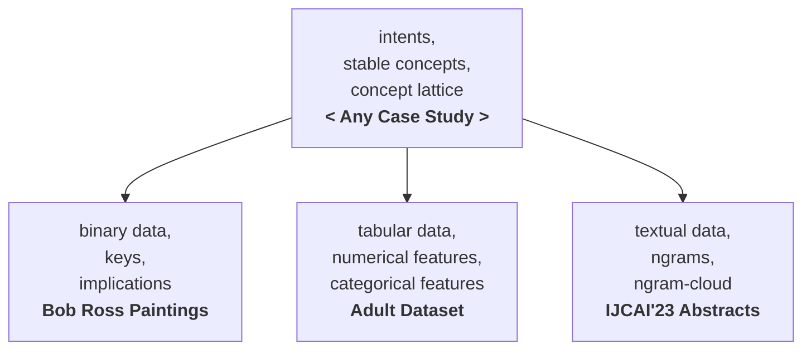

# expailleur

A repository that contains examples of using [Caspailleur](https://github.com/EgorDudyrev/caspailleur) and [Paspailleur](https://github.com/EgorDudyrev/paspailleur) packages.

Both packages serve for data mining in Python using Formal Concept Analysis (FCA) framework. The difference is that Caspailler (Characteristc-Attribute-Sets-pailleur) mines dependencies in binary data and Paspailleur (Pattern-Structures-pailleur) mines dependencies in complex (i.e. non-binary) data.

# Published Case Studies

What Case Study you might want to look at: depending on the type of data you have, on your task, etc.

Case Studies:
* [Bob Ross Paintings](#bob-ross-paintings)
* [Adult Dataset](#adult-dataset)
* [IJCAI23 abstracts](#ijcai23-abstracts)

## Bob Ross Paintings

Looking for dependencies between paintings from Bob Ross "The Joy of Painting" episodes.

**Tags**: `binary data`, `intents`, `keys`, `implications`, `stable concepts`.

**The link**: https://github.com/EgorDudyrev/expailleur/blob/main/Bob%20Ross%20Paintings.ipynb

**Note**: Made for SmartFCA reunion in Montpellier (France), June 2023.

## Adult Dataset

Finding stable groups of people represented in Adult (Census Income) dataset from UCI.

**Tags**: `tabular data`, `numerical features`, `categorical features`, `intents`, `stable concepts`.

**The link**: https://github.com/EgorDudyrev/expailleur/blob/main/Adult%20Dataset.ipynb

**Note**: Made "Computational Notebooks for FCA" (CoNo-Concepts 2023) workshop at ICFCA 2023, Kassel (Germany), July 2023.

## IJCAI23 Abstracts

Finding stable ngrams in the abstracts of papers from IJCAI'23 conference.

**Tags**: `textual data`, `ngrams`, `intents`, `stable concepts`, `ngram-cloud`.

**The link**: https://github.com/EgorDudyrev/expailleur/blob/main/IJCAI23%20abstracts.ipynb

# Funding
The package is being developed while working in a team [Orpailleur](https://orpailleur.loria.fr) (french for "gold-miner") in [Loria](https://www.loria.fr) laboratory (Nancy, France). 

The package development is supported by ANR project SmartFCA (ANR-21-CE23-0023).

SmartFCA (https://www.smartfca.org/) is a big platform that will contain many extensions of Formal Concept Analysis including pattern structures, Relational Concept Analysis, Graph-FCA and others. Functionality, provided by Caspailleur and Paspailleur, will serve as a part of back-end for SmartFCA.
