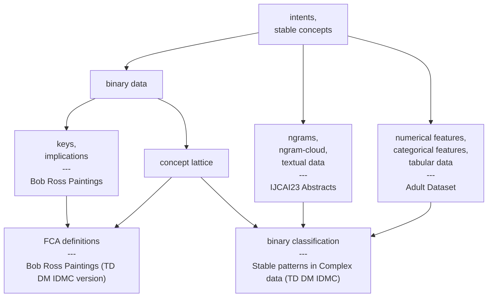

# expailleur

A repository that contains examples of using [Caspailleur](https://github.com/EgorDudyrev/caspailleur) and [Paspailleur](https://github.com/EgorDudyrev/paspailleur) packages.

Both packages serve for data mining in Python using Formal Concept Analysis (FCA) framework. The difference is that Caspailler (Characteristc-Attribute-Sets-pailleur) mines dependencies in binary data and Paspailleur (Pattern-Structures-pailleur) mines dependencies in complex (i.e. non-binary) data.

# Usage Examples

## Hierarchy of Examples
The diagram shows the hierarchy of Usage Examples with their common tags (in regular font) and the links to the studies (in bold).
One can view the diagram as a decision tree, where the decision is "what Example to look at based on my needs".

More elaborated descriptions of the Usage Examples are presented below.
Links to sections:
* [Bob Ross Paintings](#bob-ross-paintings)
* [Bob Ross Paintings (TD DM IDMC version)](#bob-ross-paintings-td-dm-idmc)
* [IJCAI23 Abstracts](#ijcai23-abstracts)
* [Adult Dataset](#adult-dataset)
* [Stable patterns in Complex data (TD DM IDMC)](#stable-patterns-in-complex-data-td-dm-idmc)

_The diagram is constructed automatically from the following descriptions using [update_mermaid](https://github.com/EgorDudyrev/expailleur/blob/main/update_mermaid.py) script.
One node and one edge were moved manually to make the diagram more nicely looking._

## Bob Ross Paintings

Looking for dependencies between paintings from Bob Ross "The Joy of Painting" episodes.

**Tags**: `binary data`, `intents`, `keys`, `implications`, `stable concepts`.

**The link**: https://github.com/EgorDudyrev/expailleur/blob/main/Bob%20Ross%20Paintings.ipynb

**Note**: Made for SmartFCA reunion in Montpellier (France), June 2023.

## Bob Ross Paintings TD DM IDMC

Study dependencies from Bob Ross Paintings and study the main terms of FCA at the same time.

**Tags**: `binary data`, `intents`, `keys`, `implications`, `stable concepts`, `FCA definitions`, `concept lattice`.

**The link**: https://github.com/EgorDudyrev/expailleur/blob/main/Bob%20Ross%20Paintings%20(TD%20DM%20IDMC%20version).ipynb

**Note**: An updated version of Bob Ross Paintings example. Made for the students of Data Mining course in IDMC, Nancy (France), October 2023.

## Adult Dataset

Finding stable groups of people represented in Adult (Census Income) dataset from UCI.

**Tags**: `tabular data`, `numerical features`, `categorical features`, `intents`, `stable concepts`.

**The link**: https://github.com/EgorDudyrev/expailleur/blob/main/Adult%20Dataset.ipynb

**Note**: Made "Computational Notebooks for FCA" (CoNo-Concepts 2023) workshop at ICFCA 2023, Kassel (Germany), July 2023.

## IJCAI23 Abstracts

Finding stable ngrams in the abstracts of papers from IJCAI'23 conference.

**Tags**: `textual data`, `ngrams`, `intents`, `stable concepts`, `ngram-cloud`.

**The link**: https://github.com/EgorDudyrev/expailleur/blob/main/IJCAI23%20abstracts.ipynb

## Stable patterns in Complex data TD DM IDMC

Finding the stable patterns in binary, tabular, and textual data using (almost) the same pipeline 

**Tags**: `intents`, `stable concepts`, `binary data`, `concept lattice`, `ngrams`, `ngram-cloud`, `textual data`, `numerical features`, `categorical features`, `tabular data`, `binary classification`.

**The link**: https://github.com/EgorDudyrev/expailleur/blob/main/Mining%20interesting%20patterns%20in%20complex_data%20(TD%20DM%20IDMC).ipynb

# Funding
The package is being developed while working in a team [Orpailleur](https://orpailleur.loria.fr) (french for "gold-miner") in [Loria](https://www.loria.fr) laboratory (Nancy, France). 

The package development is supported by ANR project SmartFCA (ANR-21-CE23-0023).

SmartFCA (https://www.smartfca.org/) is a big platform that will contain many extensions of Formal Concept Analysis including pattern structures, Relational Concept Analysis, Graph-FCA and others. Functionality, provided by Caspailleur and Paspailleur, will serve as a part of back-end for SmartFCA.
